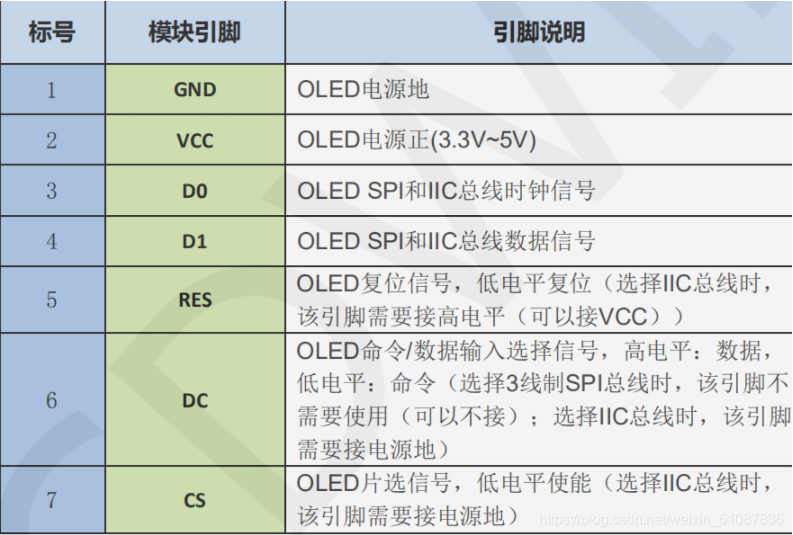
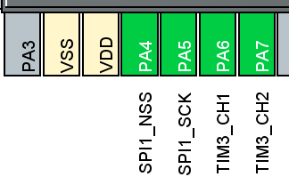
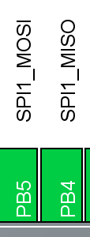
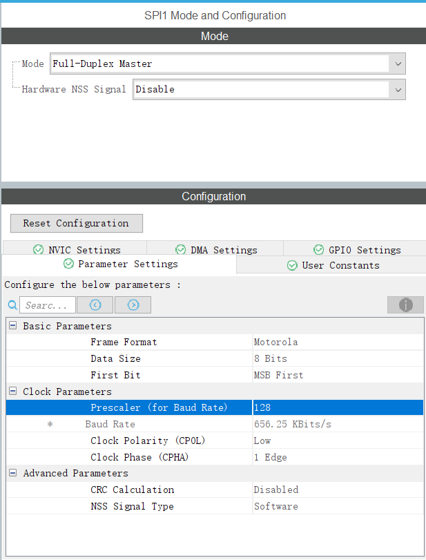
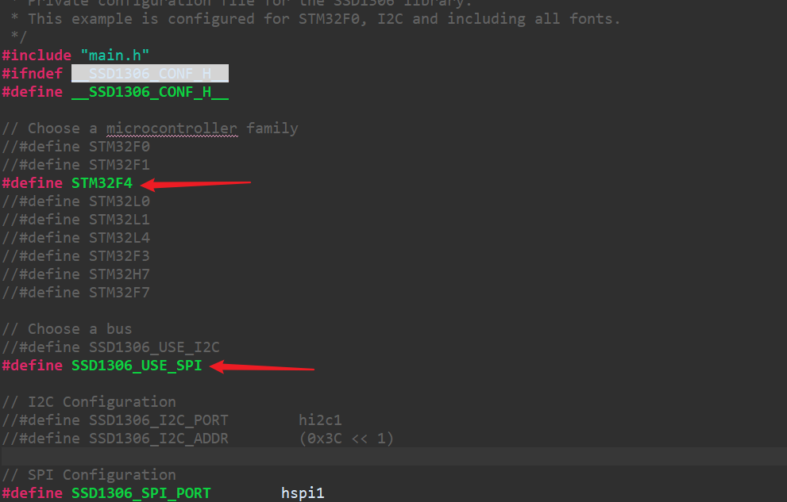

## SPI

### SPI OLED 资料 

from csdn

- https://blog.csdn.net/Zach_z/article/details/72902591
- https://blog.csdn.net/weixin_51087836/article/details/111488021
  此为某同学课设，有画字符方式。

### SPI 接口

https://blog.csdn.net/bytxl/article/details/50324427
此介绍了SPI接口的基本信息简介。

 SCK = SCLK = SCL = SPI的时钟（Serial Clock） 【才知道QAQ，艹了】

### OLED SPI应用

#### 硬件配置

**引脚说明，此处我使用了4线spi。**

所以，我们有以下的硬件连接：

OLED                    STM32
GND      <---------->   GND
VCC      <---------->   3.3V
D0       <---------->   (CLK)
D1       <---------->   (MOSI)
RES      <---------->   (RET复位)  **接入vcc**
DC       <---------->   (命令|数据dc) **可以不接**
CS       <---------->   GND

在cube中配置有

#### 业务代码

**对ssd1306_conf.h中进行更改即可对OLED的使用**

**注意**

需要Include main.h否则无法寻找到定义的管脚

